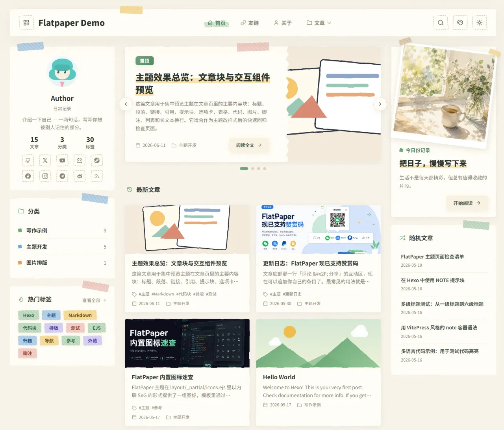
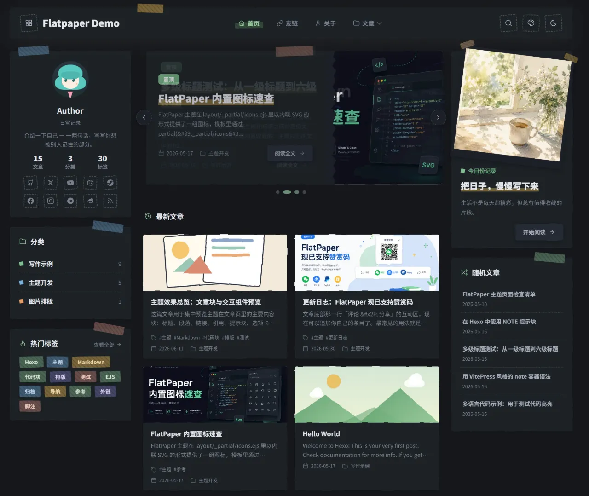

# FlatPaper

FlatPaper is a Hexo theme for quiet personal publishing: soft paper surfaces, flat illustration details, sticky notes, tape strips, and a reading interface that stays calm on both desktop and mobile.

- [Live demo](https://flatpaper.nep.me/)
- [Author's blog](https://homulilly.com/)
- 中文文档：[README.md](README.md)

## Screenshots

| Light mode | Dark mode |
| --- | --- |
|  |  |

## Installation

```bash
# inside your Hexo site
git clone https://github.com/Homulilly/hexo-theme-flatpaper.git themes/flatpaper

# copy and edit the theme config
cp themes/flatpaper/_config.en.yml _config.flatpaper.yml
```

`_config.en.yml` is an English copy template and is kept in sync with `_config.yml`, but it is not loaded as the theme's default config by itself. If you need to change the theme's default configuration directly, edit `_config.yml`.

Enable the theme in your site `_config.yml`:

```yaml
theme: flatpaper
```

Run Hexo:

```bash
hexo cl
hexo g
hexo s
```

Open <http://localhost:4000>.

To enable RSS, install `hexo-generator-feed` and configure it in the site `_config.yml`:

```bash
pnpm add hexo-generator-feed
```

```yaml
feed:
  enable: true
  type: atom
  path: atom.xml
  limit: 20
  content: true
```

To generate a sitemap, install `hexo-generator-sitemap` and add the sitemap config to site `_config.yml`:

```bash
pnpm add hexo-generator-sitemap
```

```yaml
sitemap:
  path: sitemap.xml
```

## Quick Examples

Add a post cover:

```yaml
---
title: Weekend Walk
date: 2026-05-16
cover: /images/walk.jpg
---
```

Pin featured posts on the home page:

```yaml
featured:
  - hello-world
  - markdown-elements-showcase
featured_autoplay: 5000
```

Add a foldable note:

```markdown

When a title is provided, the note renders as a foldable disclosure.

```

Create a custom links page:

```yaml
---
title: Links
type: links
---
```

During generation, FlatPaper also emits `/friend.json` from friend links in `source/_data/links.yml` that have `rss` configured. Use that URL as Friend-Circle-Lite's `spider_settings.json_url`.

Create a built-in friend-circle page and point the page front matter directly to the Friend-Circle-Lite `all.json` file:

```yaml
---
title: Friend Circle
type: friends-feed
comments: false
fcl_all_json: https://raw.githubusercontent.com/OWNER/REPO/page/all.json
---
```

Create `source/404.md` for a custom not-found page:

```yaml
---
title: Page not found
layout: 404
permalink: /404.html
comments: false
---
```

Switch the interface language (in the site `_config.yml`; choose one):

```yaml
# Simplified Chinese
language: zh-CN
```

```yaml
# English
language: en
```

## Highlights

- **Paper-first visual system**: soft cards, dashed borders, tape decoration, CSS illustration fallbacks, and readable low-contrast surfaces.
- **Responsive shell**: three columns on home/list pages, two columns on posts, and a drawer sidebar on mobile.
- **Recent mobile polish**: mobile header keeps only menu, site title, search, and dark-mode toggle; brand links move into the sidebar; accent colors are directly selectable in the mobile drawer.
- **Accent and dark modes**: seven accent colors, cookie-persisted accent selection, `localStorage` dark mode, and pre-paint mode restoration.
- **Featured carousel**: pin up to four posts with arrows, indicators, keyboard support, autoplay, and hover/focus pause.
- **Cover image resolution**: `cover` -> `thumbnail` -> `image` -> `banner` -> first inline image, with CSS scene fallbacks.
- **Article workflow**: sticky post TOC, previous/next navigation, related posts, comment jump/share actions, and optional custom reaction buttons.
- **Code block UI**: language badge, copy/collapse controls, multiple code themes, and line-number click/double-click interactions.
- **Custom writing blocks**: NexT-compatible `` and ``, plus VitePress-style `:::` note containers.
- **Built-in pages**: archives, categories, tags, and grouped friend links from `source/_data/links.yml`.
- **Multi-language UI**: built-in interface text in Simplified Chinese and English, selected from the Hexo `language` setting with a `zh-CN` fallback; ships both `_config.yml` and `_config.en.yml`.
- **Optional integrations**: Twikoo, Artalk, Fancybox, Umami, Google Analytics 4, AdSense, custom HTML injection, and RSS profile links.

## Documentation

Detailed configuration and implementation notes live in `docs/`:

- [Configuration](docs/configuration.md)
- [Features](docs/features.md)
- [Custom tags and pages](docs/custom-tags-and-pages.md)
- [Layout and development](docs/layout-and-development.md)

## License

MIT
